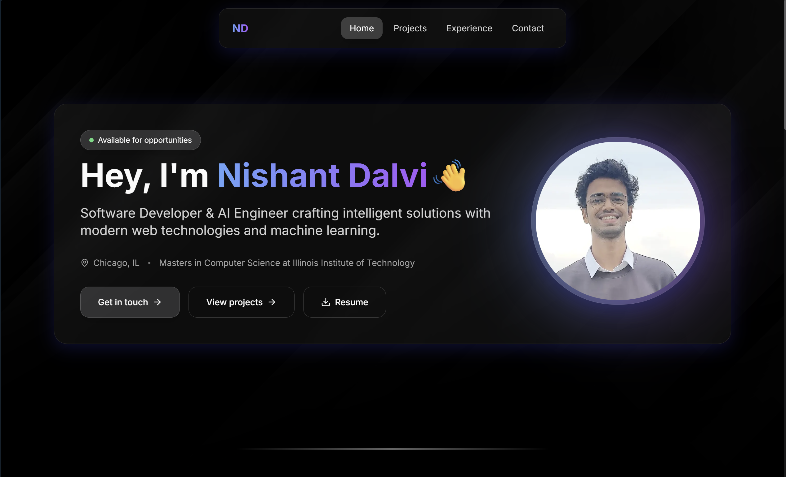

# Portfolio Website

A modern developer portfolio built with [Next.js](https://nextjs.org/), [React](https://react.dev/), [Tailwind CSS](https://tailwindcss.com/), and TypeScript.  
Showcases projects, experience, and contact information—all in a mobile-friendly, dark-themed layout.

---

## Features

- Responsive, clean UI
- Projects showcase with animated transitions
- Experience section
- Contact form with email integration (Resend)
- Theme switcher (dark mode)
- Download/view Resume functionality
- Built with modular React components and TypeScript

---

## Demo

View the live demo: _[https://nishant-portfolio-lovat.vercel.app/]_
  


---

## Tech Stack

- **Framework:** [Next.js 14+](https://nextjs.org/)
- **Styling:** [Tailwind CSS](https://tailwindcss.com/), Glassmorphism, Custom CSS
- **Forms & Validation:** React Hook Form, [Zod](https://zod.dev/)
- **Email:** [Resend](https://resend.com/)
- **Icons:** [Lucide React](https://lucide.dev/)
- **Deployment:** [Vercel](https://vercel.com/)

---

## Getting Started

### 1. Clone the repo

```
git clone https://github.com/YOUR_USERNAME/nishant-portfolio.git
cd nishant-portfolio
```

### 2. Install dependencies

```
pnpm install
# or
npm install
```

### 3. Set up environment variables

Create a `.env.local` file in the root directory with:

```
RESEND_API_KEY=your_resend_key_here
```

> Make sure to set up [Resend](https://resend.com/) and your sender domain if using email contact!

### 4. Run the dev server

```
pnpm dev
# or
npm run dev
```

Visit `http://localhost:3000` to get started.

---

## Customization

- **Resume:** Replace `public/resume.pdf` with your own.
- **Profile & Content:** Edit `intro.tsx`, `projects.tsx`, and `experiences.tsx` for your info.
- **Theme, Colors, and Layouts:** Edit `tailwind.config.ts` and `globals.css`.
- **Header/Footer:** Tweak navigation in `header.tsx` and `footer.tsx`.
- **Contact Form:** Integrates with Resend by default; swap to your favorite provider if you prefer.

---

## Author

**Nishant Dalvi**  
[LinkedIn](https://linkedin.com/in/nishant-dalvi) &nbsp;|&nbsp; [Email](mailto:ndalvi.cs@gmail.com)